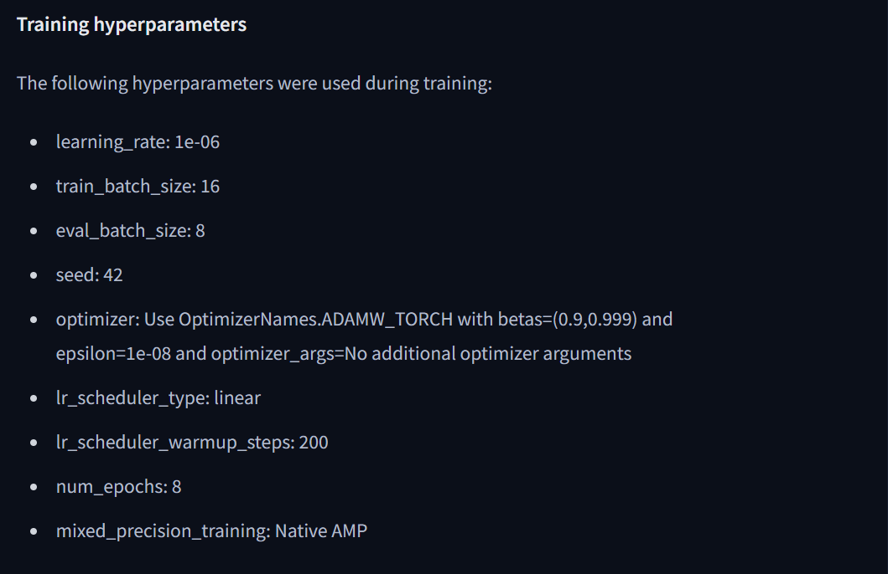
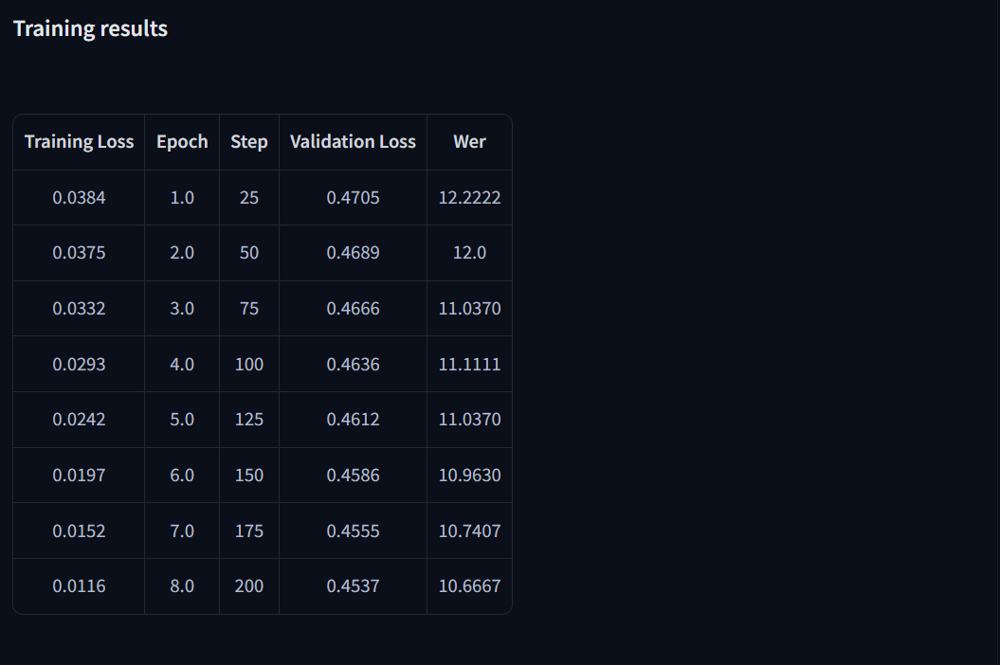

## Note
February 2025

This project was built in 24 hours during my third-year at a college hackathon - GeneSys @ PES University.

## Overview
Automated system that transcribes doctor-patient conversations into structured digital prescriptions using Whisper ASR, fine tuned for conversations containing medical terms.

## 🚀 Features

- **AI-Powered Transcription**: Fine-tuned Whisper ASR Small achieving 10.6% Word Error Rate for medical terminology ([Bhaveen/Medical-Speech-Transcription-Whisper-Small-Fine-Tuned](https://huggingface.co/Bhaveen/Medical-Speech-Transcription-Whisper-Small-Fine-Tuned))
- **Structured Output**: One-shot prompting to format transcriptions into digital prescriptions
- **Multi-Role Authentication**: Secure login system for Patients, Doctors, and Pharmacists
- **Real-time Recording**: Browser-based audio recording and transcription
- **PDF Generation**: Automated prescription PDF creation and storage
- **Cloud Storage**: Firebase integration for secure data management
- **Prescription Tracking**: End-to-end prescription workflow from doctor to pharmacist

## 🛠️ Tech Stack

- **AI/ML**: WhisperAI (Fine-tuned), OpenAI GPT-4, Transformers
- **Frontend**: React.js, HTML5, CSS3, Font Awesome
- **Backend**: Flask (Python), Firebase Realtime Database
- **Storage**: Firebase Cloud Storage
- **Authentication**: Firebase Authentication
- **Audio Processing**: Web Audio API, MediaRecorder
- **PDF Generation**: FPDF (Python)

## 📁 Project Structure

```
GeneSys-Medical-Speech-Transcription/
├── Firebase/                     # Backend Firebase integration
│   ├── fetch_records.py          # Database query functions
│   ├── firebase_stuff.py         # Core Firebase operations
│   ├── login_firebase.py         # Authentication logic
│   ├── pdf.py                    # PDF generation
│   ├── register_firebase.py      # User registration
│   └── text_formatting.py        # AI text processing
├── react_web/                    # Frontend React application
│   ├── public/                   # Static assets
│   ├── src/ 
│   │   ├── components/           # React components
│   │   │   ├── login.js          # Login interface
│   │   │   ├── register.js       # Registration interface
│   │   │   ├── record.js         # Audio recording component
│   │   │   ├── patient.js        # Patient dashboard
│   │   │   ├── doctor.js         # Doctor dashboard
│   │   │   └── pharmacy.js       # Pharmacist interface
│   │   └── App.js                # Main application component
├── WorkingFineTuneWhisper.ipynb  # Model training notebook
├── test.ipynb                    # Testing and development
└── server.py                     # Flask backend server
```

## 🔧 Installation & Setup

### Prerequisites
- Python 3.8+
- Node.js 14+
- Firebase Account
- OpenAI API Key

### Backend Setup

1. **Clone the repository**
   ```bash
   git clone https://github.com/your-username/GeneSys-Medical-Speech-Transcription.git
   cd GeneSys-Medical-Speech-Transcription
   ```

2. **Install Python dependencies**
   ```bash
   pip install -r requirements.txt
   ```

3. **Firebase Configuration**
   - Create a Firebase project at [Firebase Console](https://console.firebase.google.com/)
   - Download service account credentials as `Firebase/credentials_new.json`
   - Enable Realtime Database and Cloud Storage

4. **Environment Variables**
   ```bash
   # Add to your environment or .env file
   OPENAI_API_KEY=your_openai_api_key
   ```

5. **Start Flask Server**
   ```bash
   python server.py
   ```

### Frontend Setup

1. **Navigate to React directory**
   ```bash
   cd react_web
   ```

2. **Install dependencies**
   ```bash
   npm install
   ```

3. **Start development server**
   ```bash
   npm start
   ```

## 🎯 Usage

### For Doctors
1. Register/Login as a Doctor
2. Navigate to the recording interface
3. Enter patient phone number
4. Record consultation audio
5. Review and edit AI-generated transcription
6. Save structured prescription

### For Patients
1. Register/Login as a Patient
2. View medical history and prescriptions
3. Download prescription PDFs

### For Pharmacists
1. Register/Login as a Pharmacist
2. View pending prescriptions
3. Mark medications as delivered
4. Track prescription fulfillment

## 🤖 AI Model Details

### Fine-tuned Whisper Model
- **Base Model**: OpenAI Whisper-Small
- **Fine-tuning**: Medical terminology dataset
- **Performance**: 10.6% Word Error Rate
- **Model Link**: [Bhaveen/Medical-Speech-Transcription-Whisper-Small-Fine-Tuned](https://huggingface.co/Bhaveen/Medical-Speech-Transcription-Whisper-Small-Fine-Tuned)

### Text Processing
- **GPT-4 Integration**: Structured prescription formatting
- **Output Format**: Symptoms, Diagnosis, Medication, Procedures, Summary





## 🔐 Security Features

- Firebase Authentication for secure user management
- Role-based access control (Doctor/Patient/Pharmacist)
- Encrypted data transmission
- Secure cloud storage for sensitive medical data

## 📊 Database Schema

### Users Collection (`/Creds`)
```json
{
  "phone_number": {
    "name": "User Name",
    "email": "user@email.com",
    "role": "doctor|patient|pharmacist",
    "password": "encrypted_password"
  }
}
```

### Medical Records (`/User`)
```json
{
  "Doctor": {
    "doctor_name": {
      "patient_phone": {
        "appointment_id": {
          "date": "YYYY-MM-DD",
          "transcript": "...",
          "diagnosis": "...",
          "medication": ["..."]
        }
      }
    }
  }
}
```


